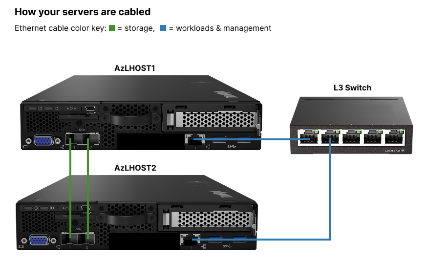

# Task 2: Deploy a 2-node Azure Local cluster

## Overview

**Context:** You connected two server nodes to the Azure cloud. Now, you want to deploy a 2-node Azure Local cluster.

**Your goal:** Use the Azure portal to deploy an Azure Local cluster using the servers `AzLHOST1` and `AzLHOST2` in the resource group `azlrg2`.

**Stop when:** Azure Local cluster deployment starts.

## Detailed instructions

Use the following details to help you create the cluster. If the instructions do not specify a configuration (like what to name the cluster), choose a name based on your professional opinion and the context provided in the task.

### Azure configuration

- **Resource group:** Create the cluster in the same RG of the servers, `azlrg2`
- **Region:** East US

### Physical network 

Each server has 3 network adapters: 

- 1 adapter for workloads and management. These are cabled to a network switch. 
- 2 adapters for storage, which are directly connected. 
The diagram below shows how these servers are cabled. 

### Local network (LAN)
- **Subnet:** 192.168.1.0 / 24
- **Default gateway:** 192.168.1.1
- **DNS server:** 192.168.1.254
- **Available IP addresses:** 192.168.1.11 – 192.168.1.200 (except for 192.168.1.20, which is the IP of the machine you’re currently using on the network).

### Network design guidelins 
1. Isolate storage traffic from the network you’ll use for workloads and managing the server. Create two subnets for storage traffic on different VLANs.  
2. Maximize storage adapter MTUs.
3. Ensure the cluster and its workloads are accessible on the local network. 
4. Assign the smallest number of IP addresses required for the cluster. 
5. Ensure the cluster's network adapters match the following configuration:

**Network Adapter Configuration**

| Server name | Adapter Name | IP Address      | VLAN |
|-------------|--------------|-----------------|------|
| AzLHOST1    | FABRIC       | 192.168.1.11    | 0    |
| AzLHOST1    | StorageA     | Auto-assigned   | 711  |
| AzLHOST1    | StorageB     | Auto-assigned   | 712  |
| AzLHOST2    | FABRIC       | 192.168.1.12    | 0    |
| AzLHOST2    | StorageA     | Auto-assigned   | 711  |
| AzLHOST2    | StorageB     | Auto-assigned   | 712  |

## Active Directory & credentials

- Join the cluster to the domain: `jumpstart.local`
- OU formatting: `OU=hcioudocs,DC=jumpstart,DC=local`
- Domain creds: `localboxdeployuser/azlTesting321!`
- Local admin creds: `administrator/azlTesting321!`

## Cluster features

- Ensure the cluster follows security best practices for a test cluster but disable bitlocker
- Create multiple cluster shared volumes for workloads

## End of task instructions

- **Stop when:** Azure Local cluster deployment starts. Let me know when you think you're done. 

## Next steps 
1. Open this link in a new tab: [prototype](https://www.figma.com/proto/iBO6B6vgjwlEzgv7p10qFi/AzL-Benchmark-Prototypes?node-id=104-35&t=68CvmXlAwhUrDkvy-1) in a new tab. Pass: `azlTesting321!`

2. Reopen the browser tab with the survey and complete question 2: [survey](https://forms.office.com/r/4bBC2WZ5qG)

3. I'll tell you when to start [Task 3](task3.md)
